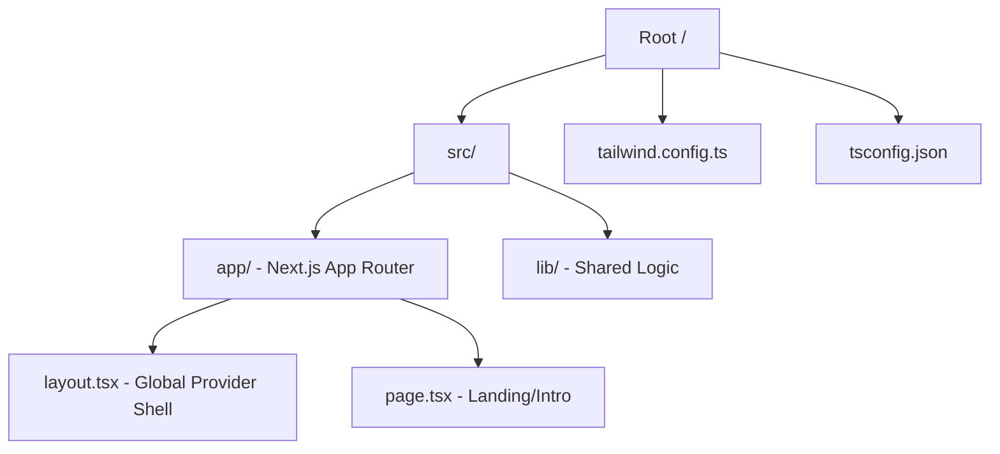

# Design: Scaffold de Next.js & Tailwind (Hito 1.1.1)

## Decisiones de Arquitectura Específicas
1. **Directorio `src`:** Se utilizará la estructura `/src` para separar el código fuente de las configuraciones de raíz.
2. **Path Aliases:** Configurar `@/*` para `/src/*` en `tsconfig.json`.
3. **Tailwind Tokens:** Definir una paleta de colores extendida en `tailwind.config.ts` bajo la clave `vento` para reutilización centralizada.

## Diagrama de Estructura Inicial


## Contratos de Tipos (Tokens Base)
```typescript
// tailwind.config.ts snippet
const ventoTheme = {
  colors: {
    background: '#0a0a0a', // Deep Neutral
    foreground: '#ededed',
    accent: '#3b82f6',
  },
  borderRadius: {
    'vento': '0.75rem',
  }
}
```
