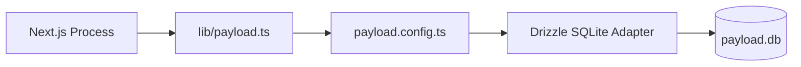

# Design: Integración de PayloadCMS & Drizzle (Hito 1.1.2)

## Decisiones de Arquitectura Específicas
1. **Payload Root Config:** El archivo de configuración principal se ubicará en `/src/payload.config.ts`.
2. **Local API Singleton:** Implementar un patrón singleton para la inicialización de Payload en `src/lib/payload.ts` para evitar múltiples instancias en desarrollo (Hot Reload).
3. **Secret Management:** Utilizar variables de entorno (`PAYLOAD_SECRET`, `DATABASE_URI`) para la configuración sensible.

## Diagrama de Integración


## Contratos de Configuración (Stub)
```typescript
// payload.config.ts
import { sqliteAdapter } from '@payloadcms/db-sqlite'
import { buildConfig } from 'payload/config'

export default buildConfig({
  admin: { user: 'users' },
  collections: [], // Se llenarán en la Fase 2
  db: sqliteAdapter({
    client: { url: process.env.DATABASE_URI || 'file:./payload.db' },
  }),
  secret: process.env.PAYLOAD_SECRET || '',
})
```
