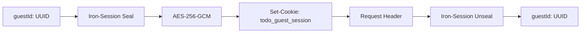

# Design: Core de Iron-Session (Hito 1.2.1)

## Decisiones de Arquitectura Específicas
1. **Helper Unificado:** Se creará un archivo `src/lib/session.ts` que centralice la configuración y los métodos de acceso.
2. **Type-Safe Session:** Definir la interfaz `SessionData` para evitar el uso de `any` en los payloads de la cookie.
3. **Environment Guard:** Validar la existencia de `SESSION_SECRET` al inicio de la aplicación.

## Diagrama de Flujo de Datos (Cifrado)


## Contrato de Interfaz
```typescript
export interface SessionData {
  guestId?: string;
  isLoggedIn: boolean;
  createdAt: string;
}

export const sessionOptions: SessionOptions = {
  password: process.env.SESSION_SECRET!,
  cookieName: "todo_guest_session",
  cookieOptions: {
    secure: process.env.NODE_ENV === "production",
  },
};
```
