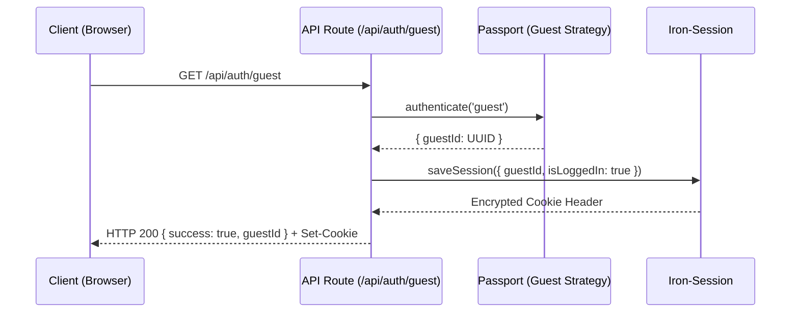

# Design: Pipeline de Autenticación (Hito 1.2.3)

## Decisiones de Arquitectura Específicas
1. **Unidireccionalidad:** El pipeline solo fluye de Passport -> Session -> Client. No hay consultas a base de datos en este punto (esto queda para el Middleware de Recuperación).
2. **Response Schema:** Utilizar un formato estandarizado para las respuestas de autenticación para facilitar el consumo desde TanStack Query.
3. **Passport Wrapper:** Crear un helper para ejecutar Passport en el entorno de Route Handlers de Next.js (que no son Express nativos).

## Diagrama de Secuencia (Auth Flow)


## Contrato de Respuesta
```typescript
type AuthResponse = {
  success: boolean;
  guestId?: string;
  error?: string;
}
```
