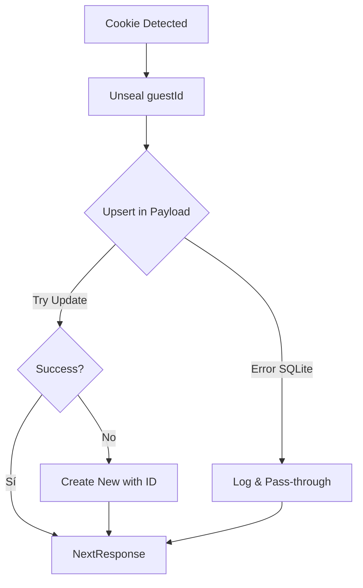

# Design: Lógica de Upsert de Sesión (Hito 1.3.2)

## Decisiones de Arquitectura Específicas
1. **Node.js Runtime Middleware:** Forzar `export const runtime = 'nodejs'` en el middleware para asegurar compatibilidad con el Local API de Payload.
2. **Idempotencia:** Utilizar el método `payload.create` con control de errores o un bloque `try/catch` envolviendo `find` + `create/update` para simular un upsert nativo si el adaptador no lo expone directamente.
3. **Optimización de Escritura:** Solo realizar el upsert si han pasado más de 15 minutos desde el último `lastActive` (opcional, para reducir carga en SQLite) o en cada carga de página inicial.

## Diagrama de Flujo de Upsert


## Contrato de Llamada Local API
```typescript
await payload.update({
  collection: 'guest-sessions',
  id: guestId,
  data: { lastActive: new Date().toISOString() },
})
```
