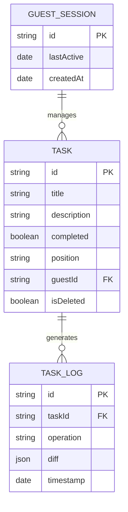

# Design: Esquemas de Colecciones Base (Hito 2.1.1)

## Decisiones de Arquitectura Específicas
1.  **UUID as ID:** Todas las colecciones utilizarán UUIDs v4. Para `GuestSessions`, el ID será explícitamente el UUID proveniente de la cookie.
2.  **LexoRank Field:** El campo `position` en `Tasks` se define como `index: true` para optimizar el ordenamiento en las consultas de SQLite.
3.  **JSON Diff Storage:** La colección `TaskLogs` utilizará un campo de tipo `json` para almacenar los deltas de las tareas, facilitando la auditoría sin esquemas rígidos.

## Diagrama de Entidad-Relación (Base)


## Estructura de Definición (Snippet)
```typescript
// Tasks Collection Config
export const Tasks: CollectionConfig = {
  slug: 'tasks',
  fields: [
    { name: 'title', type: 'text', required: true, validate: (val) => val?.length >= 3 },
    { name: 'completed', type: 'checkbox', defaultValue: false },
    { name: 'position', type: 'text', required: true, index: true },
    { name: 'isDeleted', type: 'checkbox', defaultValue: false },
  ],
}
```
