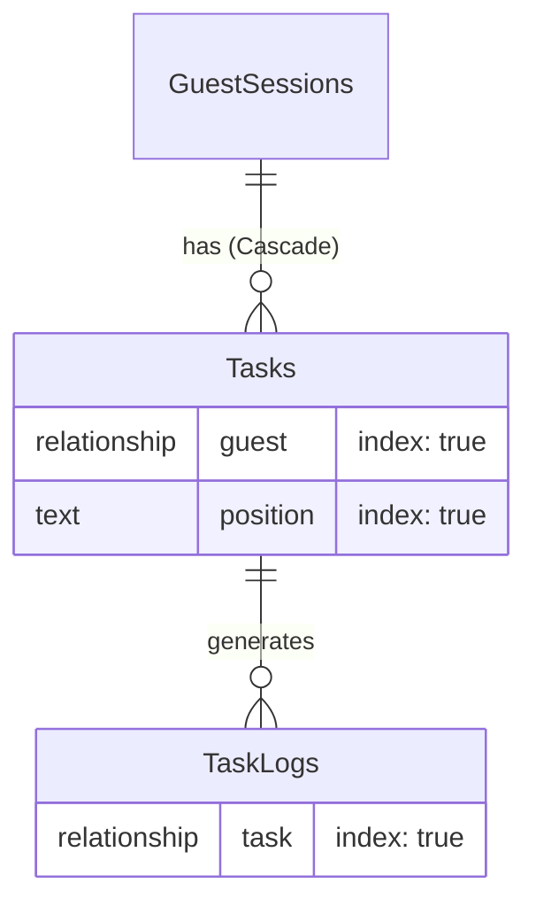

# Design: Relaciones e Índices (Hito 2.1.2)

## Decisiones de Arquitectura Específicas
1.  **Field Indexing:** Aplicar `index: true` en los campos de relación para optimizar los `JOINs` internos que realiza PayloadCMS/Drizzle.
2.  **Cascade Delete logic:** Aunque Payload maneja relaciones, la integridad de borrado se reforzará en la capa de persistencia para asegurar que la limpieza por Garbage Collection sea atómica.
3.  **Filtered Index:** Si el adaptador lo permite, considerar índices parciales para tareas no eliminadas (`isDeleted: false`), aunque para SQLite estándar usaremos índices completos.

## Diagrama de Relaciones Detallado


## Configuración de Campos (Snippet)
```typescript
// Tasks.ts Relationship Field
{
  name: 'guest',
  type: 'relationship',
  relationTo: 'guest-sessions',
  required: true,
  index: true,
  admin: {
    position: 'sidebar',
  },
}

// Tasks.ts Position Index
{
  name: 'position',
  type: 'text',
  index: true,
  required: true,
}
```
