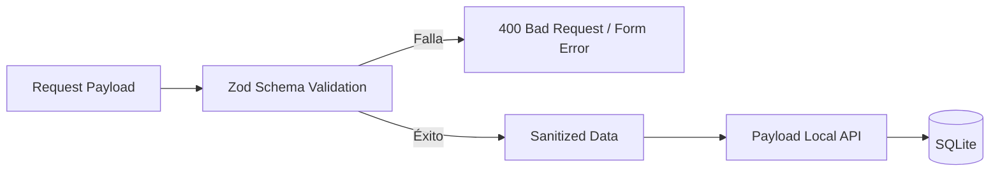

# Design: Contratos de Datos y Zod (Hito 2.1.3)

## Decisiones de Arquitectura Específicas
1. **Centralización de Esquemas:** Todos los esquemas de validación residirán en `src/lib/validation/`.
2. **Schema Composition:** Utilizar `.pick()` y `.omit()` para reutilizar el esquema base de tareas en operaciones de creación, edición y visualización.
3. **Internal vs External Types:** Diferenciar entre los tipos internos de Payload (para lógica de servidor) y los contratos de transporte (para API y Cliente).

## Diagrama de Validación de Payload


## Estructura de Contratos (Snippet)
```typescript
import { z } from 'zod';

export const TaskBaseSchema = z.object({
  title: z.string().trim().min(3, "Mínimo 3 caracteres").max(200),
  description: z.string().optional(),
  completed: z.boolean().default(false),
  position: z.string().nonempty(),
  guest: z.string().uuid(),
});

export const TaskCreateSchema = TaskBaseSchema.omit({ completed: true });
export type TaskCreateInput = z.infer<typeof TaskCreateSchema>;
```
