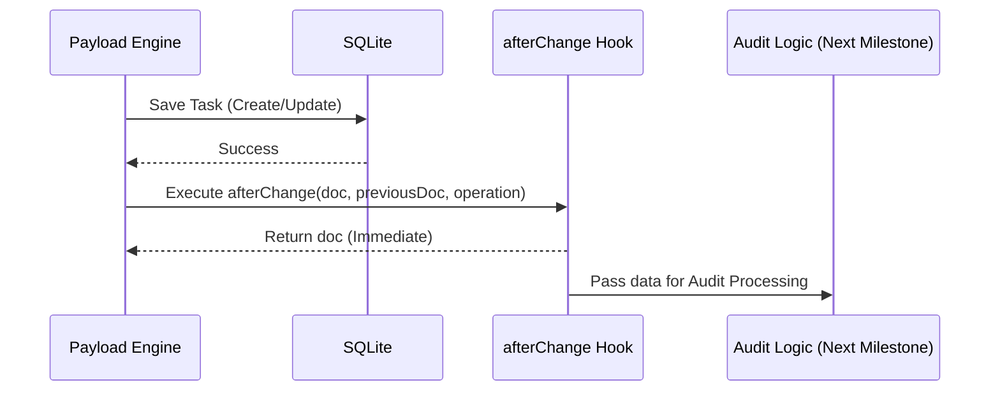

# Design: Hooks de Captura (afterChange) (Hito 2.2.1)

## Decisiones de Arquitectura Específicas
1. **Hook de Colección:** La lógica no vivirá en el controlador del API, sino en la definición de la colección `Tasks` para asegurar cobertura universal.
2. **Asincronía Controlada:** El hook devolverá el `doc` original inmediatamente para no bloquear el flujo de Payload, ejecutando la lógica de auditoría en el "fondo" (background task).
3. **Internal Log Interface:** Definir una interfaz para los datos que el hook pasará al generador de diffs en el siguiente hito.

## Diagrama de Flujo del Hook


## Contrato de Interfaz (Audit Metadata)
```typescript
interface AuditTriggerData {
  operation: 'create' | 'update';
  taskId: string;
  guestId: string;
  oldDoc?: any;
  newDoc: any;
}
```
