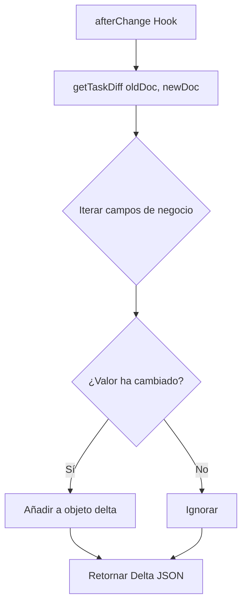

# Design: Lógica de Diferenciales (Diff) (Hito 2.2.2)

## Decisiones de Arquitectura Específicas
1. **Utility Pure Function:** La lógica se ubicará en `src/lib/audit.ts` como una función exportable e independiente de PayloadCMS para facilitar su testeo.
2. **Shallow Comparison:** Dado que el modelo de tareas es plano (sin objetos anidados complejos excepto el `id`), utilizaremos una comparación superficial (shallow) para optimizar el rendimiento.
3. **Type Safety:** Utilizar los tipos inferidos de Payload para asegurar que los campos comparados existen en el contrato de datos.

## Diagrama de Flujo de Diffing


## Contrato de la Función
```typescript
type TaskDiff = Partial<Pick<Task, 'title' | 'description' | 'completed' | 'position' | 'isDeleted'>>;

export function getTaskDiff(oldDoc: Task, newDoc: Task): TaskDiff | null {
  // Lógica de comparación...
}
```
