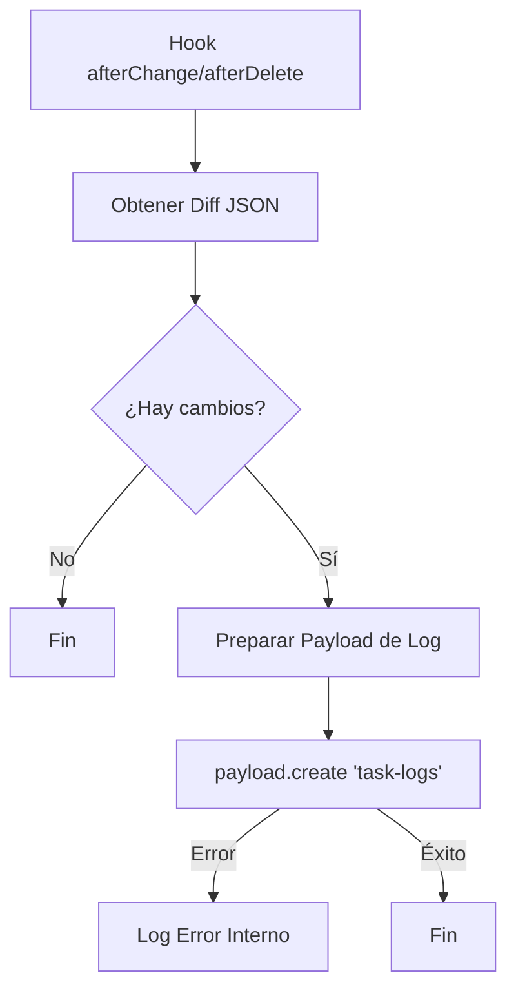

# Design: Persistencia en TaskLogs (Hito 2.2.3)

## Decisiones de Arquitectura Específicas
1. **Local API Singleton Usage:** Acceder a la instancia de `payload` desde el argumento `req.payload` disponible en los hooks para asegurar la eficiencia del Local API.
2. **Error Isolation:** Envolver la persistencia del log en un bloque `try/catch` independiente para asegurar que un fallo en la auditoría nunca impida que la tarea principal se procese correctamente (Auditoría No Bloqueante).
3. **Implicit Timestamp:** Aunque Payload genera `createdAt`, se utilizará un campo `timestamp` explícito para mayor claridad en los registros históricos.

## Diagrama de Flujo de Persistencia


## Estructura del Registro de Log
```typescript
{
  task: taskId,        // ID de la tarea afectada
  guest: guestId,      // ID del invitado
  operation: 'UPDATE', // CREATE | UPDATE | DELETE | TOGGLE
  diff: { ... },       // Delta calculado
  timestamp: new Date().toISOString()
}
```
