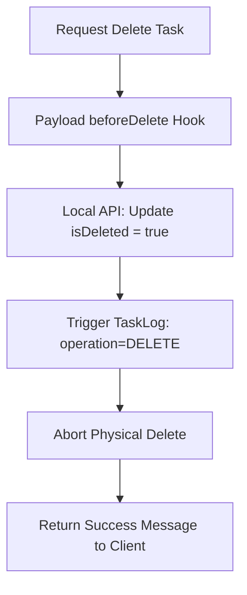

# Design: Implementación de Soft Delete (Hito 2.3.1)

## Decisiones de Arquitectura Específicas
1. **Hidden Field:** El campo `isDeleted` estará oculto por defecto en el panel admin (`admin: { hidden: true }`) para evitar manipulaciones manuales incoherentes, siendo gestionado exclusivamente por hooks.
2. **Hook logic:** Dado que `beforeDelete` en Payload no permite transformar la operación en un `update` de forma nativa sin que Payload intente seguir con el borrado, utilizaremos una combinación de actualización manual vía Local API y lanzamiento de un error de validación "SoftDeletedException" si es necesario, o preferiblemente el patrón de actualizar y retornar un error que el middleware capture.
3. **Audit Link:** El hook de soft delete debe asegurar que el registro en `TaskLogs` refleje fielmente que la tarea fue "borrada" lógicamente.

## Diagrama de Flujo de Intercepción


## Estructura del Hook (Concepto)
```typescript
const beforeDeleteHook: CollectionBeforeDeleteHook = async ({ id, req }) => {
  await req.payload.update({
    collection: 'tasks',
    id,
    data: { isDeleted: true },
  });
  // Abortamos el borrado físico
  throw new APIError('Soft delete performed', 200); 
};
```
