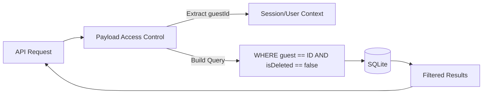

# Design: Filtros de Acceso Global (Hito 2.3.2)

## Decisiones de Arquitectura Específicas
1. **Predicate over Boolean:** Utilizar funciones de acceso que retornen predicados (cláusulas where) para que Payload optimice la consulta a nivel de SQL, en lugar de realizar el filtrado en memoria tras recuperar todos los registros.
2. **Session Injection:** Asegurar que el middleware de recuperación (Fase 1) pueble correctamente el objeto de petición para que las funciones de acceso tengan el `guestId` disponible.
3. **Admin Bypass:** Permitir que los usuarios de la colección `Users` (administradores) vean todos los registros sin filtros para facilitar la gestión técnica.

## Diagrama de Filtro de Consulta


## Estructura de la Función de Acceso (Snippet)
```typescript
const isGuestAndActive: Access = ({ req: { user } }) => {
  if (user?.collection === 'users') return true; // Admin bypass
  
  if (user?.guestId) {
    return {
      and: [
        { guest: { equals: user.guestId } },
        { isDeleted: { equals: false } }
      ]
    };
  }
  
  return false; // Deny by default
};
```
