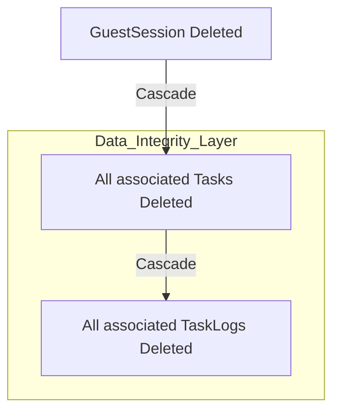

# Design: Política de Borrado en Cascada (Hito 2.3.3)

## Decisiones de Arquitectura Específicas
1.  **Native SQLite Constraints:** Aunque Payload gestiona lógica en el servidor, configuraremos el adaptador de base de datos para que las tablas en SQLite incluyan físicamente las cláusulas `FOREIGN KEY (...) REFERENCES ... ON DELETE CASCADE`.
2.  **Referencia Doble:** Los logs de auditoría apuntarán tanto a la tarea como al invitado para permitir limpiezas rápidas si una sesión se borra pero algunas tareas quedaran (aunque el diseño es en cascada multinivel).
3.  **Soft Delete Bypass:** La política de cascada afectará a todos los registros, incluyendo aquellos marcados como `isDeleted: true`, asegurando una limpieza total del rastro del invitado.

## Diagrama de Cascada de Datos


## Estructura de Relación (Snippet)
```typescript
// En src/collections/Tasks.ts
{
  name: 'guest',
  type: 'relationship',
  relationTo: 'guest-sessions',
  required: true,
  index: true,
  // Payload 3.0 / Drizzle hint para cascada física
  db: {
    foreignKey: {
      onDelete: 'cascade',
    },
  },
}
```
