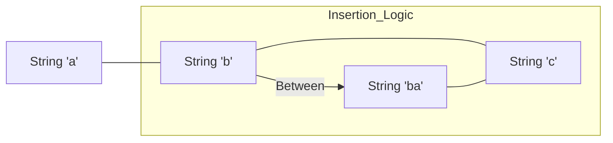

# Design: LexoRank Utility Core (Hito 3.1.1)

## Decisiones de Arquitectura Específicas
1. **Pure Functions:** La utilidad se implementará como una clase con métodos estáticos o funciones puras en `src/lib/lexo.ts` para asegurar que sea testeable sin dependencias.
2. **Infinite Precision:** La lógica debe permitir el crecimiento del string dinámicamente si se alcanza el límite de caracteres entre dos puntos (bucket exhaustion).
3. **Constants:** Definir los límites (`MIN_CHAR`, `MAX_CHAR`, `MID_CHAR`) de forma centralizada.

## Diagrama de Lógica Lexicográfica


## Contrato de Interfaz
```typescript
export interface LexoRankSystem {
  readonly ALPHABET: string;
  generateInitial(): string;
  generateBetween(prev: string | null, next: string | null): string;
}

// Implementación sugerida en src/lib/lexo.ts
export const LexoRank = {
  // logic...
}
```
