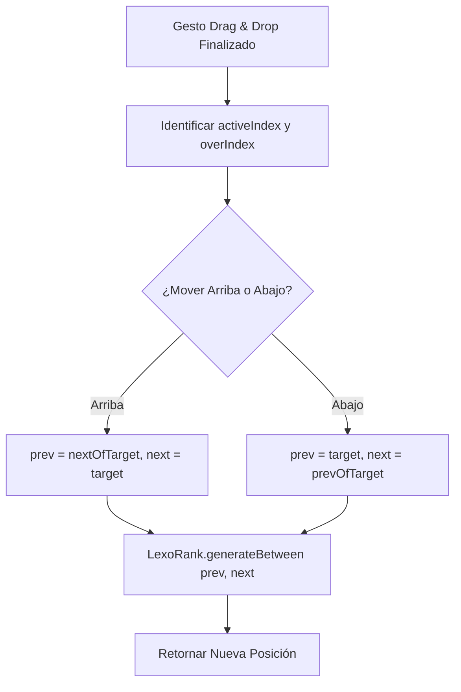

# Design: Lógica de Cálculo de Rangos (Hito 3.1.2)

## Decisiones de Arquitectura Específicas
1. **Array-based Logic:** El cálculo se basará en el índice del array de tareas ya ordenado en el cliente para identificar rápidamente a los vecinos `prev` y `next`.
2. **Deterministic IDs:** La función utilizará los IDs únicos de las tareas para localizar las posiciones originales y destino de forma segura.
3. **Optimistic-Ready:** El resultado debe ser devuelto sincrónicamente para que el hook de mutación pueda usarlo de inmediato en el caché de TanStack Query.

## Diagrama de Flujo de Cálculo


## Contrato de la Función
```typescript
interface TaskPositionParams {
  tasks: Task[];
  activeId: string;
  overId: string;
}

export function calculateNewPosition({ tasks, activeId, overId }: TaskPositionParams): string {
  // Lógica de vecindad...
}
```
