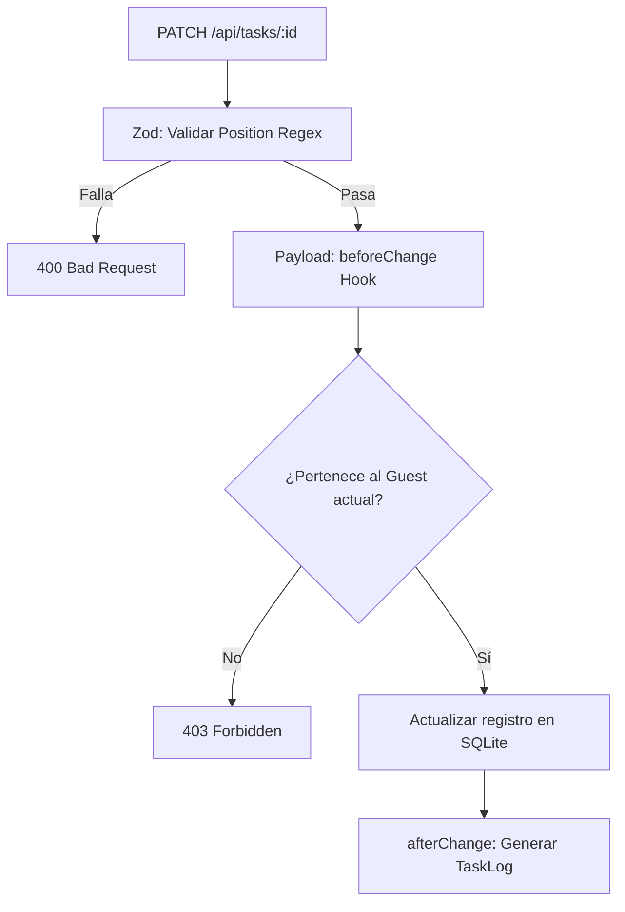

# Design: Validación y Persistencia (Hito 3.1.3)

## Decisiones de Arquitectura Específicas
1. **Schema-level Validation:** El esquema de Zod para tareas (`TaskUpdateSchema`) incluirá una regex estricta para el alfabeto Base-62: `/^[0-9a-zA-Z]+$/`.
2. **Hook-based Integrity:** Utilizar el hook `beforeChange` en Payload para verificar que el `guestId` del documento coincide con el del usuario autenticado, reforzando la seguridad a nivel de datos.
3. **Audit Log Integration:** Asegurar que el diferencial (`diff`) del log incluya explícitamente el cambio en el campo `position`.

## Diagrama de Validación en Servidor


## Estructura de Validación (Zod)
```typescript
const positionSchema = z.string()
  .min(1)
  .regex(/^[0-9a-zA-Z]+$/, "Formato de índice inválido");
```
