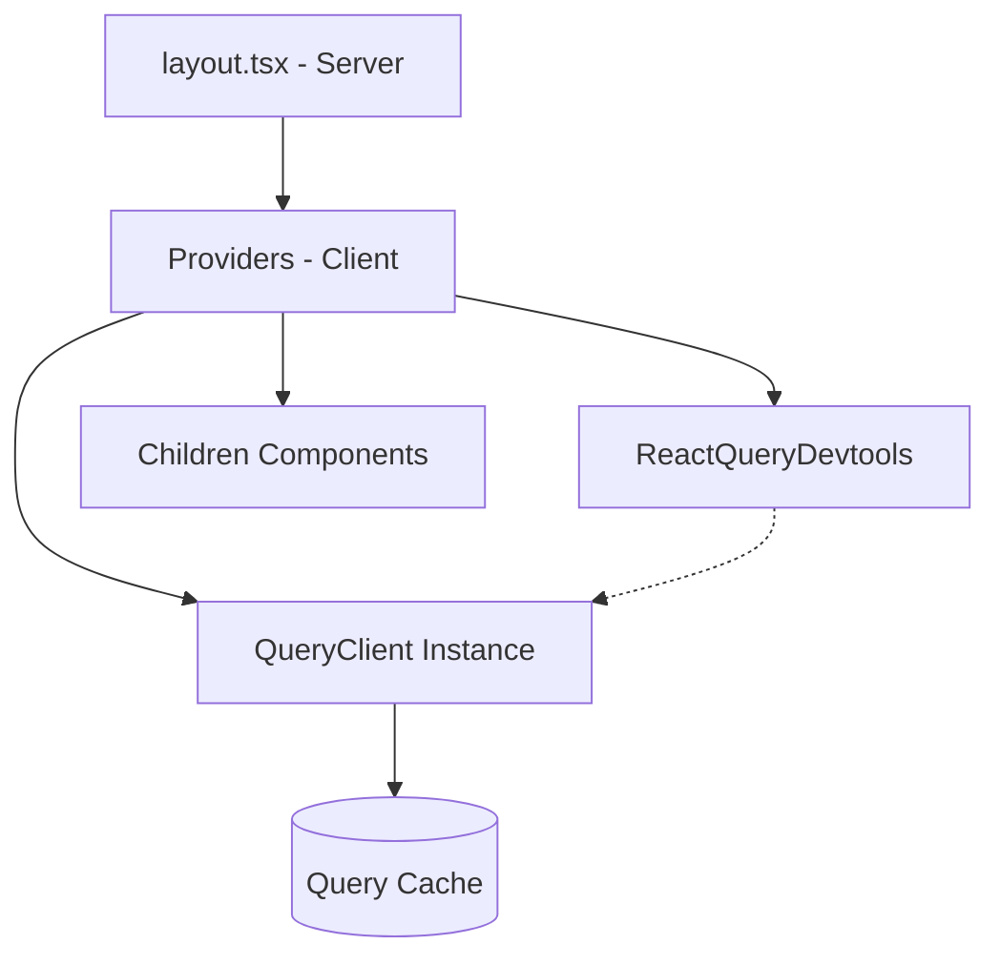

# Design: Provider & Client Config (Hito 3.2.1)

## Decisiones de Arquitectura Específicas
1. **Singleton Client Pattern:** El `QueryClient` se inicializará fuera del componente de Provider para asegurar que la instancia persista durante el ciclo de vida de la sesión del invitado.
2. **Client Components Wrapper:** Crear `src/app/providers.tsx` con `'use client'` para inyectar el contexto de React en el layout raíz de Next.js.
3. **Strict Type-Safety:** Configurar el cliente para que use los tipos globales de PayloadCMS en sus genéricos por defecto.

## Diagrama de Capa de Estado


## Estructura del Provider (Snippet)
```typescript
"use client";
import { QueryClient, QueryClientProvider } from "@tanstack/react-query";

const queryClient = new QueryClient({
  defaultOptions: {
    queries: {
      staleTime: 60 * 1000,
      retry: (failureCount, error) => {
        // Lógica de reintento para SQLITE_BUSY
        return failureCount < 3;
      }
    },
  },
});

export function Providers({ children }: { children: React.ReactNode }) {
  return (
    <QueryClientProvider client={queryClient}>
      {children}
    </QueryClientProvider>
  );
}
```
