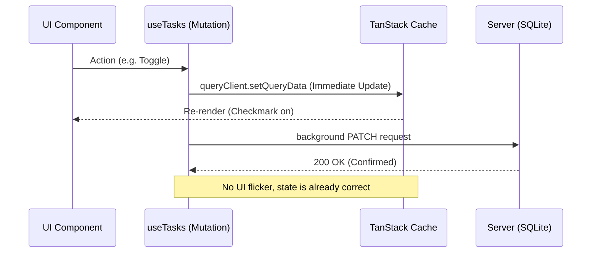

# Design: Optimistic Hook Implementation (Hito 3.2.2)

## Decisiones de Arquitectura Específicas
1. **Query Key Strategy:** Utilizar una clave jerárquica `['tasks', guestId]` para asegurar que las actualizaciones optimistas afecten únicamente al segmento de datos del usuario actual.
2. **Snapshot Pattern:** En cada mutación, guardar el estado previo devolviéndolo en `onMutate`, permitiendo que el Hito 3 implemente el rollback si SQLite devuelve `SQLITE_BUSY`.
3. **Immutability:** Realizar actualizaciones de caché utilizando spreads de objetos o utilidades funcionales para no mutar directamente el estado de TanStack Query.

## Diagrama de Flujo Optimista


## Estructura del Hook (Snippet)
```typescript
export function useTasks() {
  const queryClient = useQueryClient();
  const { guestId } = useAuth();

  const toggleMutation = useMutation({
    mutationFn: (id: string) => patchTask(id, { completed: !current }),
    onMutate: async (id) => {
      await queryClient.cancelQueries({ queryKey: ['tasks', guestId] });
      const previousTasks = queryClient.getQueryData(['tasks', guestId]);
      
      queryClient.setQueryData(['tasks', guestId], (old: Task[]) => 
        old.map(t => t.id === id ? { ...t, completed: !t.completed } : t)
      );
      
      return { previousTasks };
    },
    // onError y onSettled se verán en el Hito 3
  });
}
```
