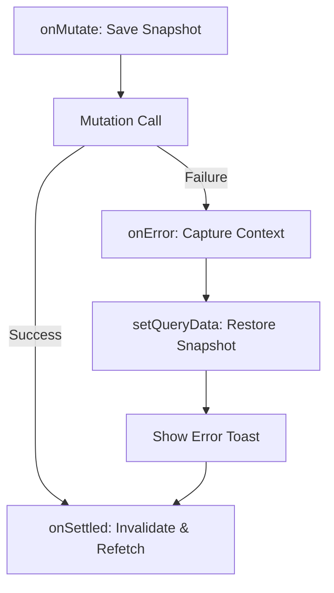

# Design: Rollback & Error Handling (Hito 3.2.3)

## Decisiones de Arquitectura Específicas
1. **Context-based Rollback:** La lógica de reversión dependerá exclusivamente del objeto de contexto devuelto por `onMutate`, asegurando que el rollback sea específico para el segmento de datos afectado.
2. **Global Error Logger:** Integrar un logger de errores en el callback `onError` para registrar incidentes técnicos en la consola del servidor/cliente.
3. **Invalidation Strategy:** Usar `queryClient.invalidateQueries` con un refinamiento de filtros para no recargar datos innecesarios, optimizando la persistencia local.

## Diagrama de Flujo de Error


## Estructura de Callback (Snippet)
```typescript
onError: (err, id, context) => {
  if (context?.previousTasks) {
    queryClient.setQueryData(['tasks', guestId], context.previousTasks);
  }
  toast.error("Error al actualizar la tarea");
},
onSettled: () => {
  queryClient.invalidateQueries({ queryKey: ['tasks', guestId] });
}
```
