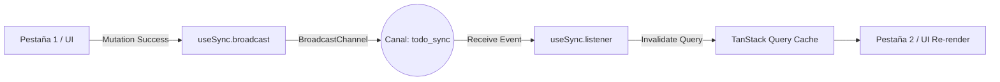

# Design: BroadcastChannel Sync (Hito 3.3.1)

## Decisiones de Arquitectura Específicas
1. **Channel Naming:** Nombre de canal constante (`todo_sync`) definido en `/src/lib/constants.ts`.
2. **Event Payload:** El mensaje siempre incluirá el `guestId` para evitar que usuarios diferentes en el mismo navegador se sincronicen entre sí.
3. **Hook Abstraction:** El hook expondrá un método `broadcast(type)` para simplificar el envío de mensajes.

## Diagrama de Comunicación Cross-Tab


## Contrato de Mensajes
```typescript
interface SyncEvent {
  type: 'TASKS_UPDATED' | 'SESSION_UPDATED';
  guestId: string;
}
```
