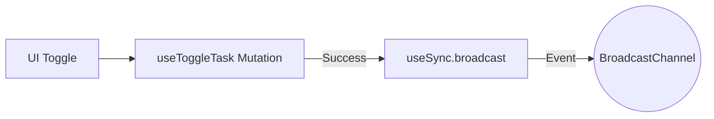

# Design: Evento en Toggle (Hito 3.3.2.1)

## Decisiones de Arquitectura
1. **Hook Integration:** La llamada a `broadcast` se colocará en el callback `onSuccess` del hook `useToggleTask`.
2. **Event Payload:** Usar el tipo de evento estándar `TASKS_UPDATED` para que el listener general procese la invalidación de caché.

## Diagrama

