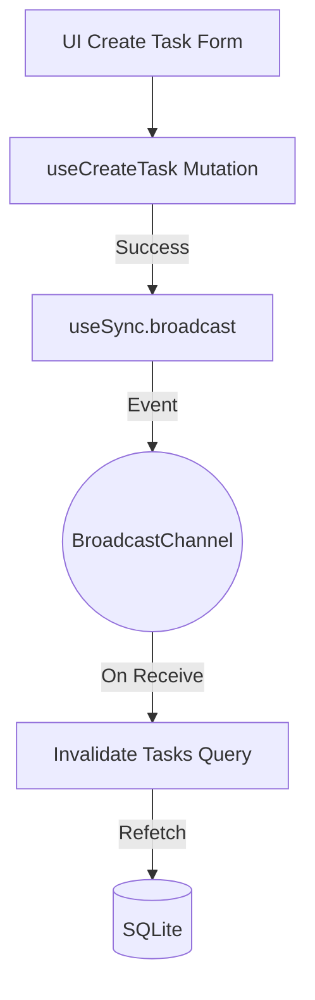

# Design: Evento en Create (Hito 3.3.2.3)

## Decisiones de Arquitectura
1. **Mutation Lifecycle:** Inyectar el broadcast en `onSuccess` para asegurar que el refetch solo ocurra cuando la persistencia en SQLite ha sido confirmada.
2. **Payload Consistency:** El mensaje debe contener el `guestId` para mantener el aislamiento entre usuarios anónimos en el mismo navegador.

## Diagrama de Flujo


## Contrato de Implementación (Snippet)
```typescript
// useCreateTask mutation hook
onSuccess: () => {
  broadcast({ type: 'TASKS_UPDATED', guestId });
}
```
