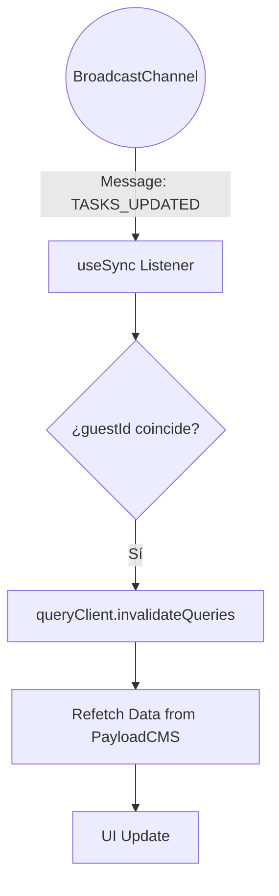

# Design: Invalidación de Caché Cross-Tab (Hito 3.3.3)

## Decisiones de Arquitectura Específicas
1. **Hook-Based Listener:** El listener residirá en el hook `useSync`, el cual tendrá acceso al `queryClient` vía `useQueryClient`.
2. **Context-Aware Invalidation:** El listener comparará el `guestId` del payload del evento con el `guestId` del contexto de autenticación local.
3. **Optimización:** Usar `invalidateQueries` sin `refetchType: 'all'` (por defecto) para que el refetch solo afecte a las queries activas.

## Diagrama de Sincronización


## Contrato de Implementación (Snippet)
```typescript
channel.onmessage = (event) => {
  if (event.data.type === 'TASKS_UPDATED' && event.data.guestId === currentGuestId) {
    queryClient.invalidateQueries({ queryKey: ['tasks', currentGuestId] });
  }
};
```
