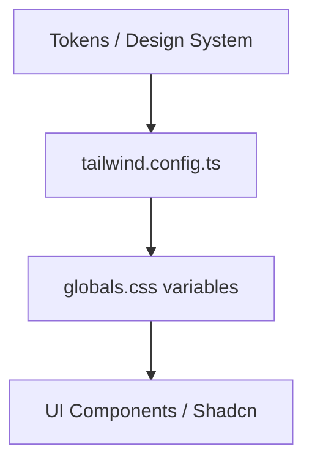

# Design: Tailwind & Theme Setup (Hito 4.1.1)

## Decisiones de Arquitectura Específicas
1. **Design Tokens:** Definir la escala de colores `vento-neutral` (50-950) y los radios `vento-sm` a `vento-xl`.
2. **Global CSS:** Limpiar los estilos default de Next.js y establecer el reset base.
3. **Typography:** Configurar `@import 'geist/dist/fonts/geist-sans/index.css'` y mapear a la propiedad `fontFamily` de Tailwind.

## Diagrama de Tokens


## Estructura de Configuración (Snippet)
```typescript
// tailwind.config.ts
module.exports = {
  theme: {
    extend: {
      colors: {
        vento: { neutral: { 900: '#0a0a0a' } }
      },
      fontFamily: {
        sans: ['Geist Sans', 'sans-serif'],
      }
    }
  }
}
```
