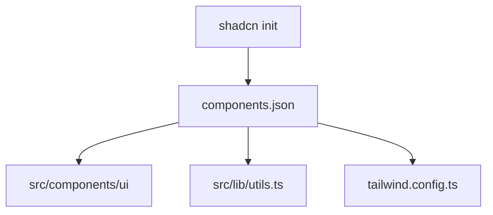

# Design: Shadcn CLI Initialization (Hito 4.1.2.1)

## Decisiones de Arquitectura
1. **Directory Structure:** Se ha forzado la ubicación en `src/components/ui` para mantener el código limpio y separado de las configuraciones.
2. **Utils Path:** El archivo `utils.ts` se ubicará en `src/lib` para agruparlo con otras utilidades de la app.
3. **Tailwind Class Merge:** El CLI configurará automáticamente `clsx` y `tailwind-merge` para el helper `cn()`.

## Diagrama de Configuración


## Configuración Esperada en components.json
```json
{
  "style": "new-york",
  "tailwind": {
    "config": "tailwind.config.ts",
    "css": "src/app/globals.css",
    "baseColor": "neutral"
  },
  "aliases": {
    "components": "@/components",
    "utils": "@/lib/utils"
  }
}
```
