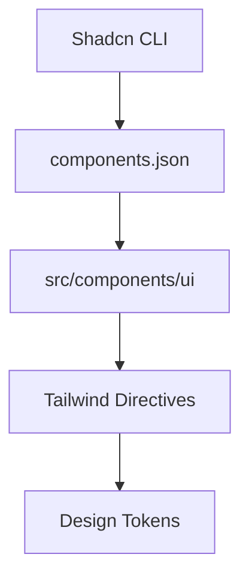

# Design: Shadcn Core Integration (Hito 4.1.2)

## Decisiones de Arquitectura
1. **Source of Truth:** Los componentes se mantendrán en `src/components/ui/` para facilitar su modificación directa según la evolución de la estética Vento.
2. **Naming Convention:** Seguir la convención estándar de Shadcn para la importación (`@/components/ui/...`).
3. **Library Pattern:** No crear una librería externa; mantener los componentes como parte del código fuente de la aplicación para maximizar la personalización.

## Diagrama de Integración


## Estructura de Componente (Ejemplo)
```typescript
// button.tsx
import * as React from "react";
import { cva } from "class-variance-authority";
// ... lógica de botones usando cn()
```
