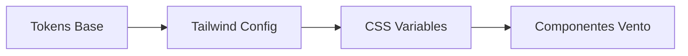

# Design: Tokens de Diseño (Hito 4.3.1)

## Arquitectura de Tokens
Utilizaremos `tailwind.config.ts` para extender la configuración base.

### Tipografía
```typescript
fontFamily: {
  sans: ["Geist Sans", "sans-serif"],
  mono: ["Geist Mono", "monospace"],
}
```

### Diagrama de Tokens (Mermaid)


## Contratos
- `spacing.vento-8`: 32px (Base spacing para contenedores)
- `colors.vento-surface`: `hsl(var(--background))`
- `colors.vento-highlight`: `#6366f1` (ejemplo de acento)
