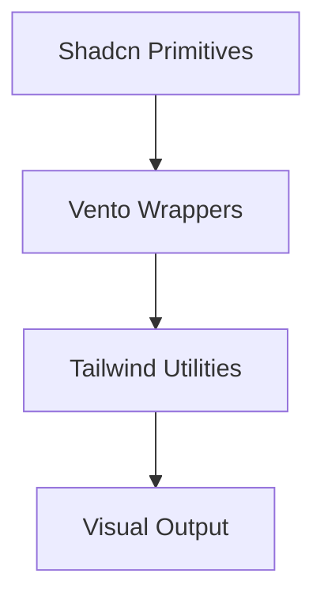

# Design: Aplicación Visual Vento (Hito 4.3.2)

## Arquitectura de Estilos
La aplicación de estilos se realizará mediante:
1. **Clases de Utilidad de Tailwind**: Para efectos rápidos (blur, opacidad).
2. **Componentes Vento**: Componentes de layout (`VentoGlow`, `VentoPanel`) que envuelven los componentes Radix.

### Diagrama de Flujo de Estilos

## Contratos Técnicos
- `VentoGlow`: Componente React que renderiza un `div` con posicionamiento absoluto y `mix-blend-screen`.
- `backdrop-blur-vento`: Clase personalizada en `globals.css` aplicando `backdrop-filter: blur(12px)`.
