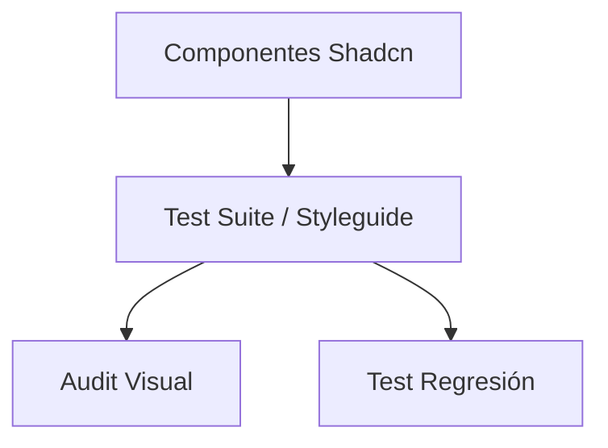

# Design: Validación Vento (Hito 4.3.3)

## Arquitectura de Validación
Utilizaremos un enfoque de "Live Styleguide" dentro del entorno de desarrollo.

### Diagrama de Validación

## Decisiones Técnicas
1. **Styleguide**: Se ubicará en `src/app/dev/styleguide`. Utilizará componentes de Shadcn organizados por secciones.
2. **Pruebas de Regresión**: Utilizaremos `vitest-image-snapshot` (o similar) para capturar componentes aislados y comparar contra imágenes de referencia.
3. **Contraste**: Script sencillo en `scripts/check-contrast.ts` que calcule los valores YIQ de las combinaciones de tokens.
