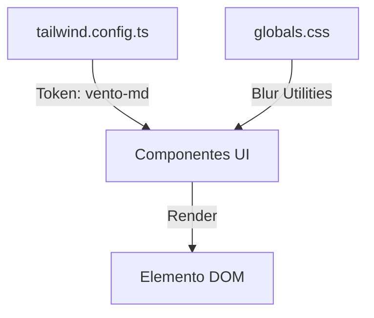

# Design: Vento Aesthetic Extensions (Hito 4.1.3)

## Decisiones de Arquitectura
1. **Extend Theme:** Añadir `borderRadius` y `boxShadow` al `tailwind.config.ts`.
2. **Global Classes:** Definir clases base como `.vento-card` para reducir la repetición de utilidades en componentes complejos.
3. **Framer Motion:** Integrar transiciones de entrada para los nuevos efectos de desenfoque.

## Diagrama de Aplicación de Estilos


## Configuración Técnica (Snippet)
```typescript
// tailwind.config.ts
theme: {
  extend: {
    borderRadius: {
      'vento-sm': '0.5rem',
      'vento-md': '0.75rem',
    },
    boxShadow: {
      'vento': '0 4px 12px rgba(0, 0, 0, 0.05)',
    }
  }
}
```
