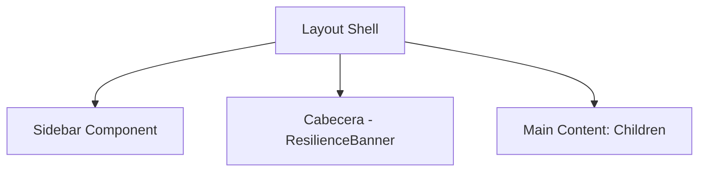

# Design: Layout & Navegación Principal (Hito 4.2.1)

## Decisiones de Arquitectura
1. **App Router Groups:** Utilizar `(dashboard)` como ruta de grupo para agrupar todas las rutas protegidas y que compartan el layout.
2. **Component Separation:** Separar el Sidebar y la Cabecera en componentes atómicos (`src/components/features/`) para evitar un archivo `layout.tsx` excesivamente grande.
3. **Container Pattern:** El contenido centralizado usará un contenedor con `max-w-4xl` para mantener la estética Vento de enfoque en el contenido.

## Estructura del Layout


## Estructura de Rutas
```text
src/app/
  (dashboard)/
    layout.tsx      # Sidebar + Header Wrapper
    page.tsx        # Mi Día
```
