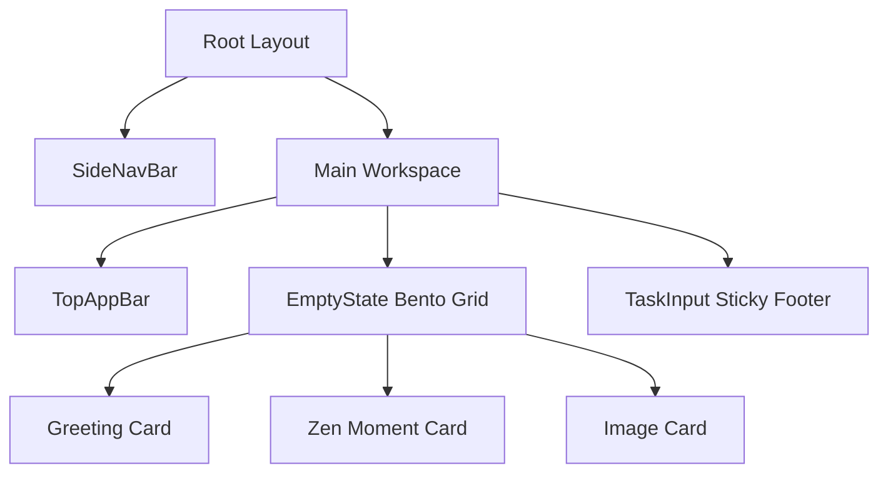

# Design: EmptyState Component & Vento Layout (Hito 4.2.2)

## Arquitectura
- **Root Layout**: Un `SidebarProvider` que envuelve un layout con `SideNavBar` y `main`.
- **Bento Grid**: Grid de CSS configurado con `md:grid-cols-4` y `md:grid-rows-6` para cumplir con la maqueta.
- **Componentes Vento**:
    - `SideNavBar`: Menú lateral estilizado.
    - `EmptyStateBento`: Grid de tarjetas con `glass-panel` y `VentoPanel`.

### Diagrama de Layout

## Decisiones Técnicas
- **Grid System**: Uso de `display: grid` con clases específicas de Tailwind para lograr el layout asimétrico de referencia.
- **Backdrop Blur**: Uso de la clase `backdrop-blur-vento` definida en el Hito anterior.
