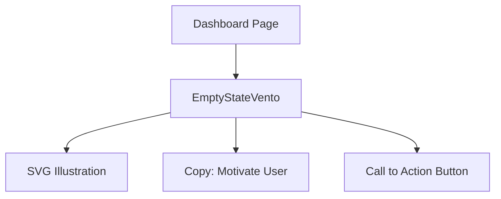

# Design: Componente EmptyState (Hito 4.2.2)

## Decisiones de Arquitectura
1. **Separación:** Componente localizado en `src/components/vento/`.
2. **Animación:** Usar `framer-motion` para una entrada suave (`fade-in`) del estado vacío.
3. **SVG Integration:** Ilustraciones minimalistas inline para mantener el componente autocontenido.

## Diagrama de Componente


## Contrato de Propiedades (Props)
```typescript
interface EmptyStateProps {
  title: string;
  description: string;
  onAction: () => void;
}
```
