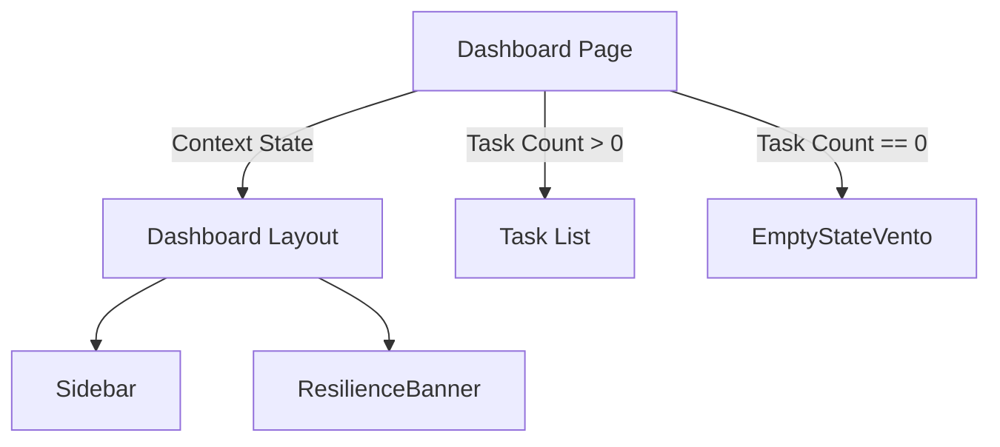

# Design: Integración y Validación (Hito 4.2.2.2)

## Decisiones de Arquitectura
1. **Conditional Rendering:** El dashboard delegará la lógica de visualización del estado vacío vs. lista de tareas a un componente contenedor.
2. **Context-Driven:** Integrar el estado de resiliencia global en la cabecera de la vista.

## Diagrama de Flujo de Vistas


## Contrato de Integración
```typescript
// Dashboard Container Logic
const Dashboard = () => {
  const { tasks } = useTasks();
  return (
     tasks.length === 0 ? <EmptyStateVento /> : <TaskList tasks={tasks} />
  );
}
```
