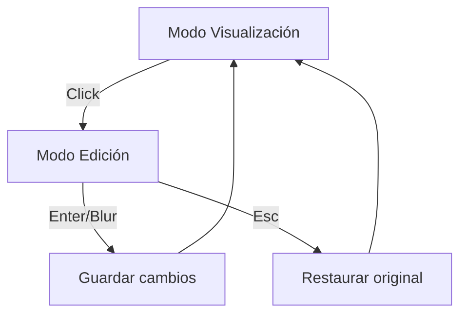

# Design: Lógica de Edición (Hito 4.3.1.1)

## Decisiones de Arquitectura
1. **Local State:** Usar `useState` para el título temporal durante la edición para evitar disparar mutaciones optimistas por cada pulsación de tecla.
2. **Commit Pattern:** La mutación solo se dispara cuando el usuario finaliza la interacción (blur, enter).
3. **Ref Access:** Usar `useRef` combinado con `useEffect` para asegurar el `focus()` tras la transición de estado.

## Diagrama de Ciclo de Edición


## Contrato de Estado Local
```typescript
const [title, setTitle] = useState(task.title);
const [isEditing, setIsEditing] = useState(false);
```
