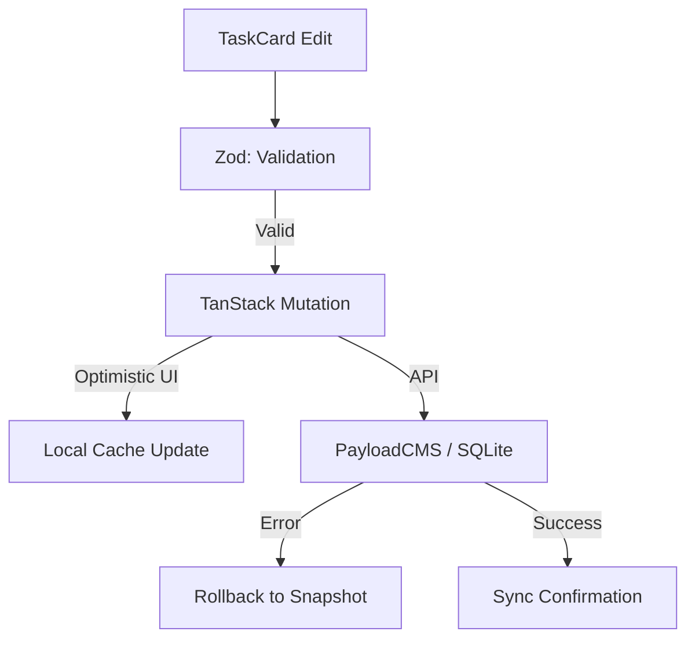

# Design: Validación y Persistencia (Hito 4.3.1.2)

## Decisiones de Arquitectura
1. **Mutation Hook:** Se utilizará `useMutation` para envolver la petición al API Route de actualización, manejando el ciclo de vida del estado.
2. **Schema Reuse:** Se reutilizará el `TaskUpdateSchema` del Hito 2.1.3 para validar el cuerpo de la petición.
3. **Optimistic Integration:** Se implementará el patrón de "restore on error" usando el snapshot guardado en el contexto de la mutación.

## Diagrama de Persistencia


## Contrato de API (Payload Request)
```typescript
interface UpdateTaskPayload {
  title: string;
}
// POST /api/tasks/:id
```
