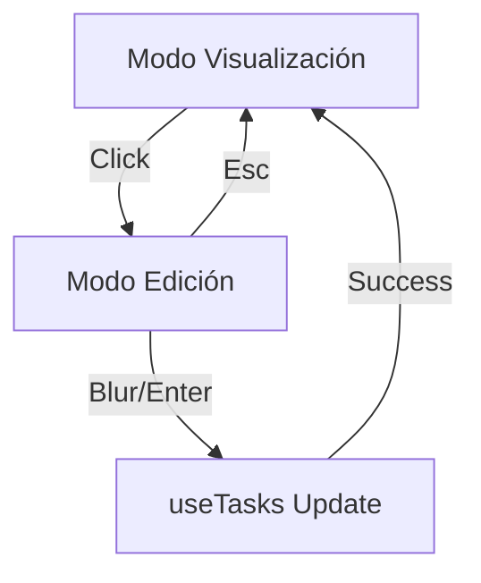

# Design: In-Place Task Card (Hito 4.3.1)

## Decisiones de Arquitectura
1. **State Isolation:** El modo de edición (`isEditing`) se gestionará mediante `useState` local en el componente `TaskCard`.
2. **Focus Management:** Uso de `useRef` para enfocar automáticamente el input tras cambiar a modo edición.
3. **Optimistic Integration:** La mutación de guardado llamará a `useTasks.updateTask` (mutación optimista) para reflejar el cambio.

## Diagrama de Interacción


## Estructura del Componente (Snippet)
```typescript
const TaskCard = ({ task }) => {
  const [isEditing, setIsEditing] = useState(false);
  const inputRef = useRef<HTMLInputElement>(null);
  
  if (isEditing) {
    return <Input ref={inputRef} defaultValue={task.title} onBlur={() => setIsEditing(false)} />;
  }
  
  return <div onClick={() => setIsEditing(true)}>{task.title}</div>;
}
```
