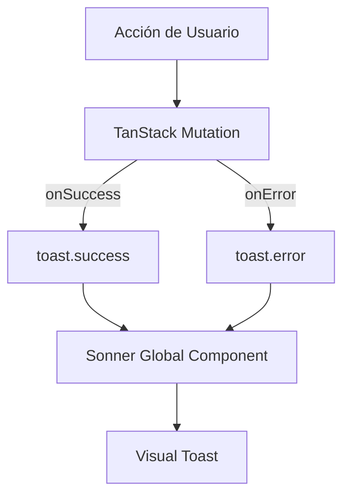

# Design: Sistema de Feedback (Sonner) (Hito 4.3.2)

## Decisiones de Arquitectura
1. **Global Provider:** Montar `<Toaster />` en el `RootLayout`.
2. **Abstract Wrapper:** Crear un helper `toastManager` en `src/lib/toast.ts` para centralizar los mensajes y evitar texto harcodeado disperso por la aplicación.
3. **Custom Styles:** Configurar los estilos de Sonner para usar el radio de borde `vento-md` y fuentes Geist Sans.

## Diagrama de Flujo de Feedback


## Contrato de Helper
```typescript
export const toastManager = {
  success: (msg: string) => toast.success(msg),
  error: (msg: string) => toast.error(msg),
};
```
