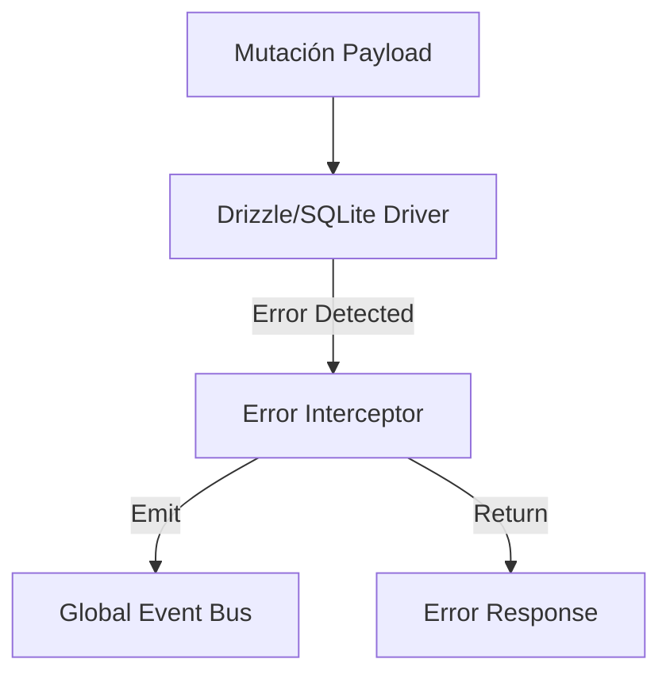

# Design: Persistence Error Interceptor (Hito 5.1.1)

## Decisiones de Arquitectura
1. **Error Wrapper:** Crear una función envoltorio alrededor de las operaciones de Drizzle que estandarice los errores de SQLite.
2. **Global Event Bus:** Utilizar un objeto `EventBus` simple (o `EventEmitter` de Node) para comunicar los fallos de persistencia desde el backend (Local API) hasta el contexto de la UI.
3. **Fail-Fast Policy:** Si ocurre un error crítico, el sistema marca `isReadOnly` = true indefinidamente en memoria (durante la sesión).

## Diagrama de Intercepción


## Contrato de Error
```typescript
interface PersistenceError {
  code: string; // SQLITE_FULL, etc.
  message: string;
  isFatal: boolean;
}
```
