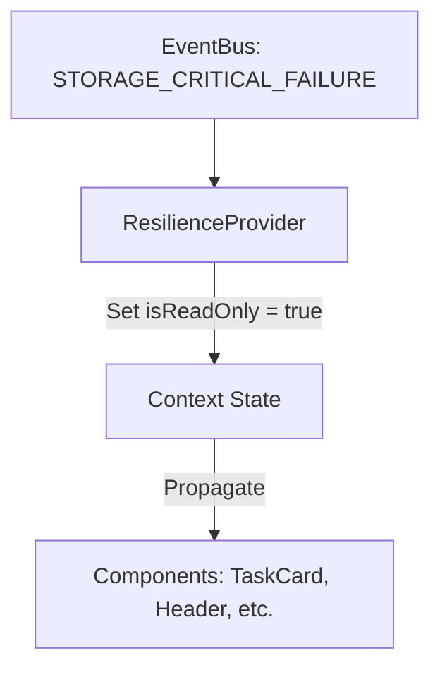

# Design: Resilience State Management (Hito 5.1.2)

## Decisiones de Arquitectura
1. **Context Pattern:** Implementar el patrón `Provider` + `Hook` para desacoplar el estado de su consumo.
2. **Event Listening:** El `ResilienceProvider` escuchará el `EventBus` (del Hito 1) en el montaje del componente.
3. **Immutability:** El estado de resiliencia será inmutable desde los componentes hijos (read-only).

## Diagrama del Flujo de Estado


## Contrato de Interfaces
```typescript
interface ResilienceContextType {
  isReadOnly: boolean;
  setReadOnly: (value: boolean) => void;
}
```
