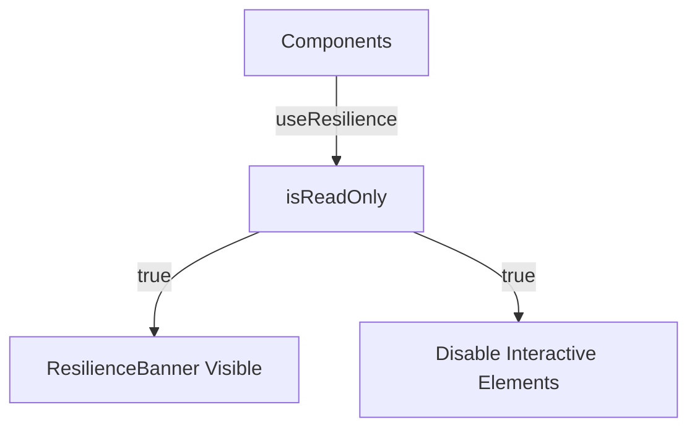

# Design: UI Lock & Banner (Hito 5.1.3)

## Decisiones de Arquitectura
1. **Banner Placement:** El `ResilienceBanner` será incluido en el `layout.tsx` principal justo debajo de la cabecera.
2. **Lock Pattern:** Crear un componente `LockedWrapper` que envuelva botones/inputs críticos.
3. **Z-Index:** Asegurar que el banner tenga una prioridad alta en la pila de capas para ser siempre visible.

## Diagrama de Bloqueo Visual


## Contrato de Componente (Snippet)
```typescript
const LockedWrapper = ({ children, isReadOnly }) => (
  <div className={cn(isReadOnly && "pointer-events-none opacity-50")}>
    {children}
  </div>
);
```
