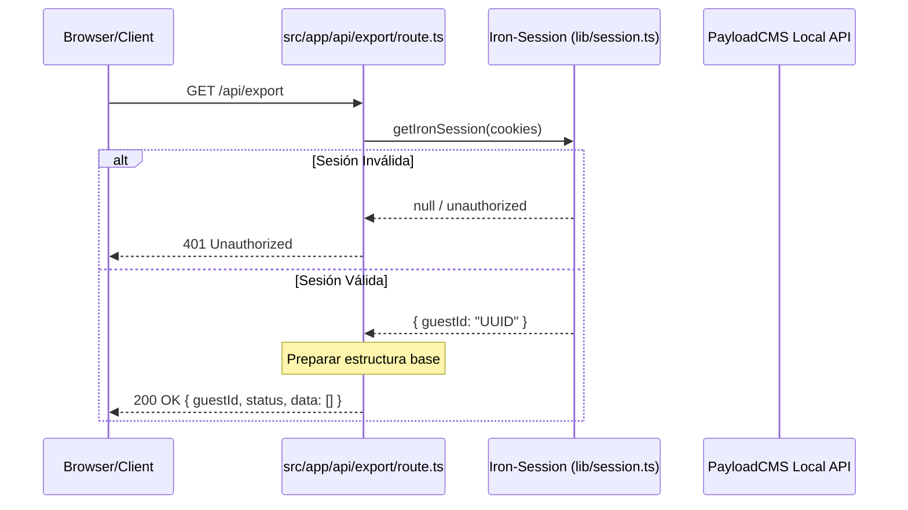

# Diseño Técnico: Hito 1 - Export API Route

## 1. Arquitectura del Endpoint

El endpoint actúa como una capa de seguridad y orquestación inicial. Se sitúa en la capa de `Transport Layer` del diseño global.



## 2. Decisiones de Diseño

### A. Ubicación del Archivo
Se utilizará la estructura estándar de Next.js App Router: `src/app/api/export/route.ts`. Esto permite una separación clara de las rutas de la interfaz de usuario y los endpoints de datos puros.

### B. Validación de Identidad
Se utilizará el helper centralizado de `iron-session`. No se deben implementar lógicas de validación de cookies personalizadas para mantener la coherencia con el middleware de autenticación del proyecto.

### C. Contrato de Datos (Hito 1 - Inicial)
Aunque la agregación completa ocurre en el Hito 2, el endpoint debe devolver una estructura que cumpla con los tipos de TypeScript del proyecto.

```typescript
// Interface conceptual para el hito 1
interface ExportResponse {
  guestId: string;
  exportDate: string;
  status: 'ready' | 'processing';
  data: {
    tasks: any[]; // Placeholder para Hito 2
    logs: any[];  // Placeholder para Hito 2
  };
}
```

## 3. Seguridad y Límites
- **Método:** Solo se permite `GET`. Otros métodos (POST, PUT, DELETE) deben retornar `405 Method Not Allowed`.
- **Headers:** 
  - `Content-Type: application/json`
  - `Cache-Control: no-store, max-age=0` (Para evitar que el navegador guarde la exportación en disco de forma insegura en caché).

## 4. Manejo de Excepciones
Cualquier error en la lectura de la cookie o en la inicialización del objeto de sesión debe ser capturado por un bloque `try/catch` global en el Route Handler para evitar fugas de información en el stack trace (500 Error).
