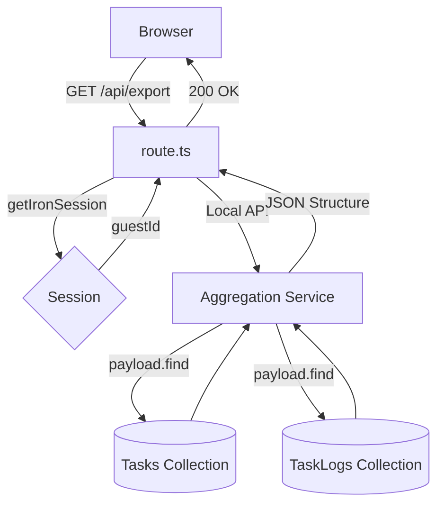

# Diseño Técnico: Hito 2 - Lógica de Agregación de Datos

## 1. Flujo de Agregación



## 2. Decisión Arquitectónica: Payload Local API
Se utilizará la API interna de Payload, ya que es el único mecanismo garantizado para aplicar los filtros de seguridad y hooks (`beforeOperation`) definidos en el `design.md` global. Esto evita consultas directas a Prisma y posibles omisiones en la seguridad de los datos.

## 3. Contrato de Datos (Respuesta Final)

```typescript
interface ExportPayload {
  guestId: string;
  exportDate: string;
  tasks: Array<{
    id: string;
    title: string;
    completed: boolean;
    position: string;
    createdAt: string;
  }>;
  logs: Array<{
    id: string;
    taskId: string;
    operation: string;
    diff: any;
    timestamp: string;
  }>;
}
```
