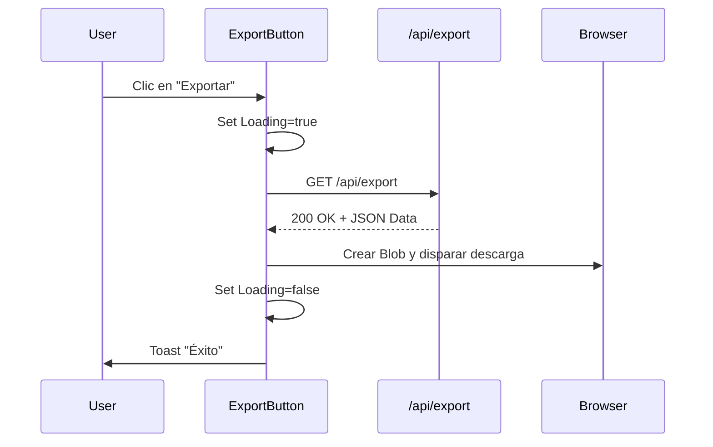

# Diseño Técnico: Hito 3 - Componente de Descarga en UI

## 1. Interacción Visual



## 2. Decisión Arquitectónica: Blob API
Utilizaremos `new Blob([JSON.stringify(data)], { type: 'application/json' })` junto con un elemento `<a>` oculto para disparar la descarga. Esta es la forma estándar y eficiente de manejar descargas en el cliente sin depender de servidores de archivos intermedios.

## 3. Contrato de Componente

```typescript
interface ExportButtonProps {
  label?: string;
  className?: string;
}

// Sonner Toast usage:
// toast.success("Datos exportados correctamente");
// toast.error("Error al exportar datos");
```
