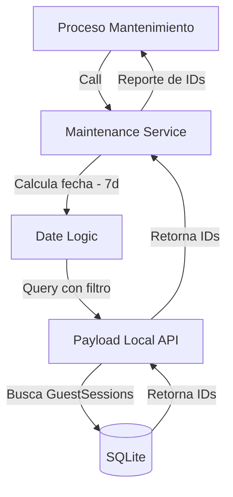

# Diseño Técnico: Hito 1 - Identificación de Sesiones Inactivas

## 1. Flujo de Identificación



## 2. Decisión Arquitectónica
Se utilizará la Local API de Payload para garantizar que la consulta respete la estructura de la colección. Se debe asegurar que el campo `lastActive` esté indexado en el esquema de Payload para optimizar el rendimiento de esta consulta de mantenimiento.

## 3. Estructura del Resultado (Interfaz)

```typescript
interface InactiveSessionReport {
  expiredSessionIds: string[];
  totalIdentified: number;
  thresholdDate: string;
}
```
