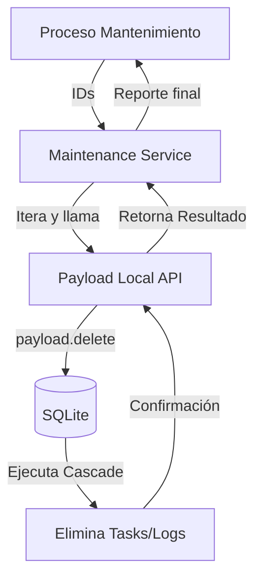

# Diseño Técnico: Hito 2 - Ejecución de Limpieza en Cascada

## 1. Flujo de Eliminación



## 2. Decisión Arquitectónica
Se confía plenamente en la configuración de `onDelete: Cascade` definida en los esquemas de Payload. No debe haber lógica manual de borrado de tareas o logs; si la sesión desaparece, los hijos deben desaparecer.

## 3. Estructura del Resultado (Interfaz)

```typescript
interface DeletionReport {
  deletedCount: number;
  errors: Array<{ id: string; error: string }>;
  successIds: string[];
}
```
