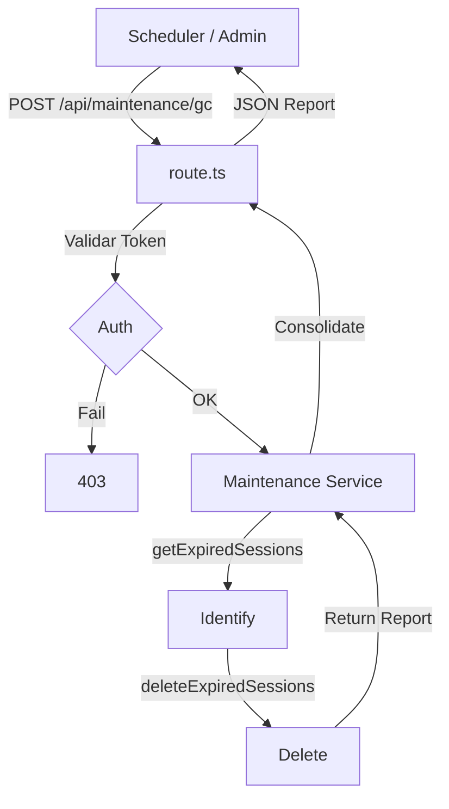

# Diseño Técnico: Hito 3 - Integración del Flujo de Mantenimiento

## 1. Flujo de Integración



## 2. Estructura de Reporte

```typescript
interface MaintenanceReport {
  status: 'success' | 'error';
  totalIdentified: number;
  deletedCount: number;
  reportDetails: DeletionReport;
  timestamp: string;
}
```
