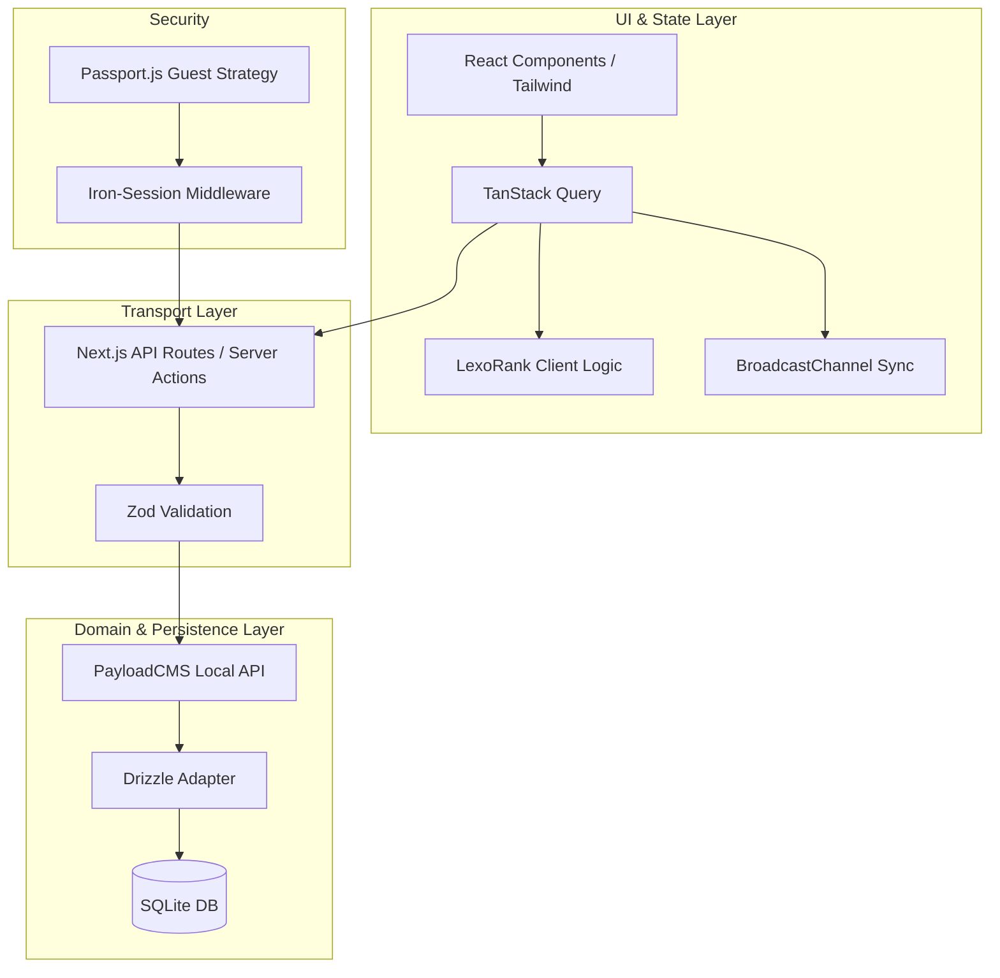

# Technical Design: Enterprise Guest-First To-Do App (design.md)

## 1. Decisiones de Arquitectura

### A. Patrón de Flujo de Datos y Capas
Se adopta una arquitectura monolítica moderna con separación clara de responsabilidades, optimizada para el **Local API** de PayloadCMS para minimizar la latencia de red en operaciones de servidor.



**Justificación:**
- **PayloadCMS Local API:** Se utiliza sobre REST/GraphQL para llamadas internas (Server Components/API Routes) para evitar el overhead de HTTP.
- **Unificación de Persistencia:** Al eliminar Prisma y usar el adaptador nativo de Payload (Drizzle), centralizamos el pool de conexiones a SQLite y eliminamos conflictos de concurrencia.

### B. Sistema de Ordenamiento y Gestión de Datos
- **LexoRank:** Se integrará la librería `lexorank` tanto en el cliente como en el servidor.
- **Lógica de Mutación:** El cliente calcula el nuevo rango (rango entre dos tareas o al final/inicio) y lo envía como un string. El servidor valida la integridad del rango antes de persistir.
- **Persistencia:** SQLite en modo WAL (Write-Ahead Logging) habilitado por defecto en el adaptador de Payload para soportar múltiples lectores y un escritor sin bloqueos.

### C. Concurrencia y Consistencia
- **Sincronización Multi-pestaña:** Se implementa un `BroadcastChannel` llamado `todo_sync`. Cada vez que TanStack Query completa una mutación exitosa, emite un evento para que otras pestañas invaliden sus queries y refetchheen.
- **Recuperación de Sesión:** Si la cookie de `iron-session` existe pero el registro en SQLite no (tras un GC), el middleware de Next.js ejecutará un `upsert` silencioso en la colección `guest-sessions` usando el ID de la cookie.

## 2. Stack Tecnológico Definido

| Tecnología | Versión | Justificación |
| :--- | :--- | :--- |
| **Next.js** | 14+ (App Router) | Framework base para SSR, Server Components y API Routes. |
| **PayloadCMS** | 3.0 (Beta/Latest) | Motor de API headless, gestión de colecciones y hooks de auditoría. |
| **SQLite** | Latest | Base de datos local física, ideal para entornos "Guest-First" locales. |
| **Drizzle ORM** | (Payload Native) | Adaptador de base de datos unificado para PayloadCMS. |
| **Iron-Session** | 8+ | Gestión de sesiones cifradas en cookies sin estado. |
| **TanStack Query** | 5+ | Gestión de estado de servidor, cache y mutaciones optimistas. |
| **LexoRank** | Latest | Algoritmo de ordenamiento lexicográfico maduro. |
| **Tailwind CSS** | 3+ | Estilos Mobile-First y soporte nativo Dark Mode (Vento style). |
| **Zod** | 3+ | Validación de esquemas y Type-Safety de extremo a extremo. |

## 3. Esquema de Datos y Contratos

### Colecciones Payload (Representación Conceptual)

**1. GuestSessions (Collection)**
- `id`: Text (UUID de la cookie).
- `lastActive`: DateTime.
- `tasks`: Has Many -> Tasks.

**2. Tasks (Collection)**
- `title`: Text (Required, min 3 chars).
- `description`: RichText/Text (Optional).
- `completed`: Checkbox (Default: false).
- `position`: Text (LexoRank string, Indexado).
- `guest`: Relationship -> GuestSessions (Required, Filtered).
- `isDeleted`: Checkbox (Soft Delete).

**3. TaskLogs (Collection)**
- `task`: Relationship -> Tasks.
- `operation`: Select (CREATE, UPDATE, DELETE, TOGGLE).
- `diff`: JSON.
- `timestamp`: DateTime.

### Interfaces TypeScript
```typescript
interface TaskContract {
  id: string;
  title: string;
  completed: boolean;
  position: string;
  guestId: string;
}

type MutationResponse = {
  success: boolean;
  data?: TaskContract;
  error?: string;
}
```

## 4. Estructura de Directorios (Scalable Path)

```text
/src
  /app
    /(dashboard)      # Layouts y vistas protegidas por sesión
    /api              # Endpoints para Iron-Session y Exports
  /collections        # Definiciones de colecciones de PayloadCMS
  /components
    /ui               # Primitives (Radix + Tailwind)
    /features         # TaskCard, TaskList, SortableWrapper
    /vento            # Componentes específicos de estilo Vento (EmptyState, Glows)
  /hooks
    /useTasks.ts      # Mutaciones optimistas y queries
    /useSync.ts       # Lógica de BroadcastChannel
  /lib
    /payload.ts       # Inicialización de Local API
    /session.ts       # Config de Iron-Session
    /lexo.ts          # Helpers para LexoRank
  /middleware.ts      # Passport + Guest Session Recovery
```

## 5. Sistema de Estilos (Vento Design)
- **Core:** Tipografía `Geist Sans` o `Inter`.
- **Paleta:** Neutros profundos para Dark Mode, espacio en blanco generoso (padding-8+).
- **Feedback:** `Sonner` para toasts. Framer Motion para el reordenamiento de tareas (transiciones de 0.2s).
- **Empty States:** Ilustraciones SVG minimalistas con gradientes sutiles.

## 6. Guardias para la Implementación (Operational Guidance)

1.  **Strict Read-Only Mode:** Si el adaptador de Payload detecta un error de escritura persistente (ej. `SQLITE_FULL`), se debe setear un flag en un `Context` global. La UI deshabilitará todos los botones de acción y mostrará un banner: *"Almacenamiento local lleno. La aplicación está en modo solo lectura."*
2.  **LexoRank Re-balancing:** Aunque LexoRank es resiliente, si el string de `position` excede los 100 caracteres, el servidor debe programar una tarea de re-balanceo silencioso para el `guestId`.
3.  **Soft Delete Hook:** Siempre usar un hook `beforeOperation` en Payload para filtrar `isDeleted: false` en todas las consultas de tareas por defecto.
4.  **No Direct SQLite:** Prohibido realizar consultas directas a la DB saltándose Payload; toda mutación debe pasar por los hooks de Payload para garantizar los logs de auditoría.
5.  **Optimistic Rollback:** En TanStack Query, siempre capturar el estado anterior en `onMutate` y restaurarlo en `onError` para evitar desincronización visual.
