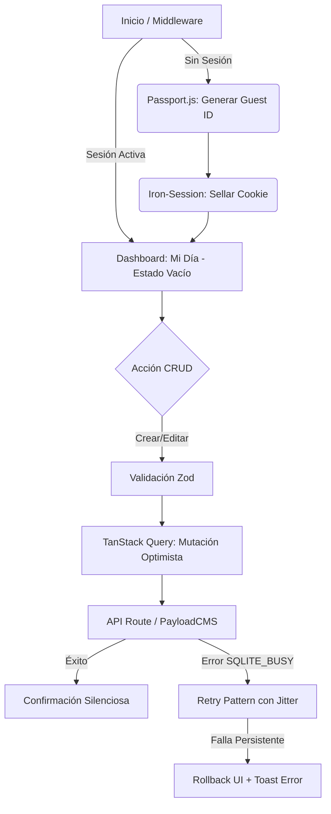

# Technical Specification: Enterprise Guest-First To-Do App (spec.md)

## 1. Visión y Objetivos
### Problema Raíz
Necesidad de una herramienta de gestión de tareas empresarial de alta fidelidad que permita una fricción cero de entrada (sin registro obligatorio inmediato) mientras mantiene una arquitectura robusta, auditable y escalable para una futura migración a cuentas persistentes.

### Solución Propuesta
Una aplicación web full-stack basada en **Next.js 14** y **PayloadCMS 3.0**, utilizando un modelo de identidad "Guest-First" gestionado por **Iron-Session** y **Passport.js**, con persistencia local en **SQLite** vía **Prisma**. El diseño se inspira en la estética **Vento**, priorizando la ligereza, el espacio en blanco y estados vacíos ("Mi Día") altamente pulidos.

### Métricas de éxito técnicas
- **Latencia de UI:** <100ms para acciones de CRUD mediante actualizaciones optimistas.
- **Integridad de Datos:** 0% de colisiones en el ordenamiento lexicográfico.
- **Resiliencia:** Manejo exitoso de bloqueos `SQLITE_BUSY` mediante patrones de reintento.

### Decisiones de Arquitectura (Patrón de Flujo de Datos)
- **Data Flow:** Unidireccional (TanStack Query -> API Routes -> PayloadCMS/Prisma -> SQLite).
- **Capas:**
    - **UI Layer:** React Components + Tailwind CSS + Framer Motion (para transiciones "Vento").
    - **State Layer:** TanStack Query (Server State) + React Context (Local UI State).
    - **Validation Layer:** Zod (Schema-first).
    - **Auth Layer:** Iron-Session (Cookie) + Passport (Identity).
    - **Persistence Layer:** Prisma ORM + SQLite WAL Mode.

---

## 2. Historias de Usuario Robustas

### Gestión Esencial
- **Como usuario invitado**, quiero acceder a la app y que se me asigne una identidad automática para empezar a crear tareas de inmediato.
- **Como usuario**, quiero editar tareas "in-place" para mantener un flujo de trabajo rápido.
- **Como usuario**, quiero que al marcar una tarea como completada, el cambio sea instantáneo en la UI (Optimistic UI).

### Eficiencia Operativa
- **Como usuario**, quiero poder arrastrar y soltar tareas para reordenarlas de forma persistente.
    - **Lineamiento:** Integración de **Lexicographical Fractional Indexing** (Base-62) para evitar re-indexaciones masivas.
- **Como usuario**, quiero buscar tareas en tiempo real mediante un campo de filtrado dinámico.

### Visual & UX (Inspiración "Vento")
- **Como usuario**, quiero ver un **Estado Vacío ("Mi Día")** visualmente atractivo que me motive a planificar mi jornada.
- **Como usuario mobile-first**, quiero una interfaz que se adapte perfectamente a mi dispositivo y soporte **Modo Oscuro** nativo.
- **Como usuario**, quiero recibir feedback visual claro (Toasts) si una acción falla.

### Resiliencia & Avanzado
- **Como usuario**, quiero que mis tareas se sincronicen instantáneamente entre pestañas del navegador (**BroadcastChannel Sync**).
- **Como usuario**, quiero exportar mis datos en formato JSON para portabilidad.

---

## 3. Flujos de Navegación Detallados



---

## 4. Criterios de Aceptación (Gherkin)

### Escenario: Recuperación de Sesión Purgada
**Given** un usuario con una cookie de sesión válida
**And** el registro `GuestSession` ha sido eliminado por el Garbage Collection
**When** el usuario recarga la aplicación
**Then** el sistema debe crear un nuevo `GuestId` silenciosamente
**And** mostrar un toast sutil: "Tu sesión anterior ha expirado; se ha iniciado una nueva sesión local."

### Escenario: Concurrencia de Escritura
**Given** múltiples mutaciones rápidas en ráfaga
**When** Prisma devuelve un error `P2034` (SQLITE_BUSY)
**Then** el backend debe reintentar la operación hasta 3 veces con jitter exponencial
**And** si falla, el cliente debe revertir solo la mutación fallida mediante TanStack Query.

---

## 5. Modelos de Datos e Interfaces

### Esquema Prisma (`schema.prisma`)
```prisma
model GuestSession {
  id        String   @id @default(uuid())
  createdAt DateTime @default(now())
  updatedAt DateTime @updatedAt
  tasks     Task[]
}

model Task {
  id          String   @id @default(uuid())
  title       String
  description String?
  completed   Boolean  @default(false)
  position    String   // Lexicographical fractional index
  guestId     String
  guest       GuestSession @relation(fields: [guestId], references: [id], onDelete: Cascade)
  createdAt   DateTime @default(now())
  updatedAt   DateTime @updatedAt
  isDeleted   Boolean  @default(false) // Soft Delete

  @@index([guestId])
}

model TaskLog {
  id        String   @id @default(uuid())
  taskId    String
  guestId   String
  operation String   // 'CREATE' | 'UPDATE' | 'DELETE' | 'TOGGLE'
  diff      Json     // Snapshot of changes
  timestamp DateTime @default(now())

  @@index([taskId])
  @@index([timestamp])
}
```

---

## 6. Restricciones Técnicas y Guías de Implementación

### Stack Tecnológico
- **Framework:** Next.js 14 (App Router)
- **CMS/API:** PayloadCMS 3.0
- **ORM:** Prisma v5
- **Database:** SQLite (WAL Mode habilitado)
- **Auth:** Iron-Session + Passport.js
- **Validation:** Zod
- **UI:** Tailwind CSS + Framer Motion + Radix UI

### Estrategia de Concurrencia y Consistencia
- **Client-side:** Implementar una **Mutation Queue** y sincronización mediante **BroadcastChannel API**.
- **Server-side:** Configurar Prisma con el mecanismo de reintentos asíncronos detallado.
- **Global Lock:** En ráfagas de alta concurrencia, el backend serializará las escrituras mediante una cola de promesas por `guestId`.

### Política de Auditoría y Garbage Collection
- **Auditoría:** Máximo 50 registros por tarea o 30 días de antigüedad.
- **GC de Sesiones:** Borrado en cascada tras 7 días de inactividad de la cookie.

### Estructura de Directorios (Scalable Path)
```text
/src
  /app (Next.js App Router)
  /collections (PayloadCMS Collections)
  /components
    /ui (Shadcn/UI base)
    /features (TaskCard, TaskList, SearchBar, EmptyStateVento)
  /hooks (useTasks, useAuth, useBroadcastSync)
  /lib
    /prisma.ts
    /payload.ts
    /session.ts
    /indexing.ts (Fractional Indexing Logic)
```

### Operational Guidance
- **Inspiración Visual:** Seguir el patrón "Vento" (tipografía sans-serif limpia, bordes redondeados suaves, sombras sutiles, micro-interacciones de Framer Motion).
- **Resiliencia:** Si SQLite falla, la app entrará en "Modo Memoria" (TanStack Query Cache) informando al usuario.
- **Type-Safety:** Prohibido el uso de `any`; integración estricta Zod -> Payload -> Prisma.
